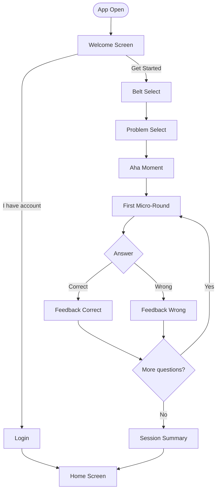
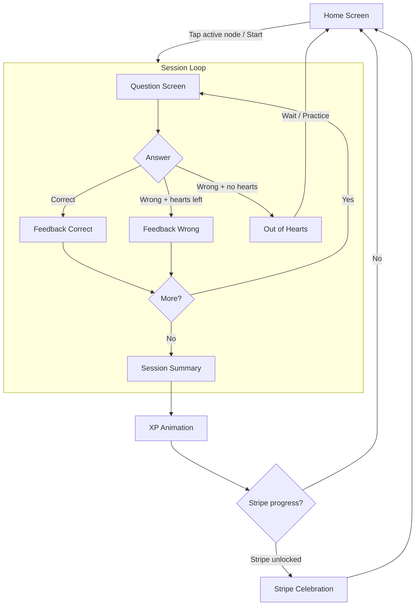
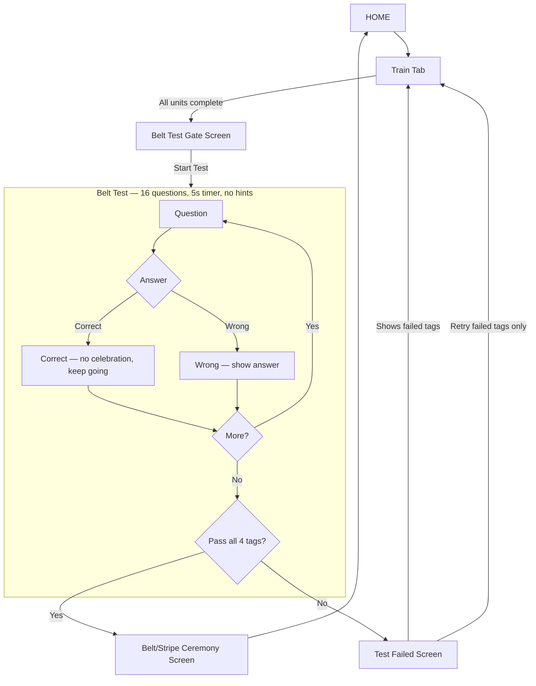
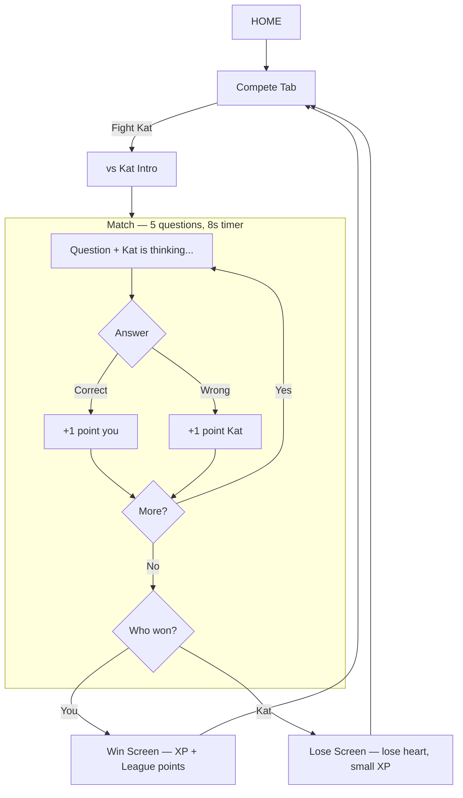
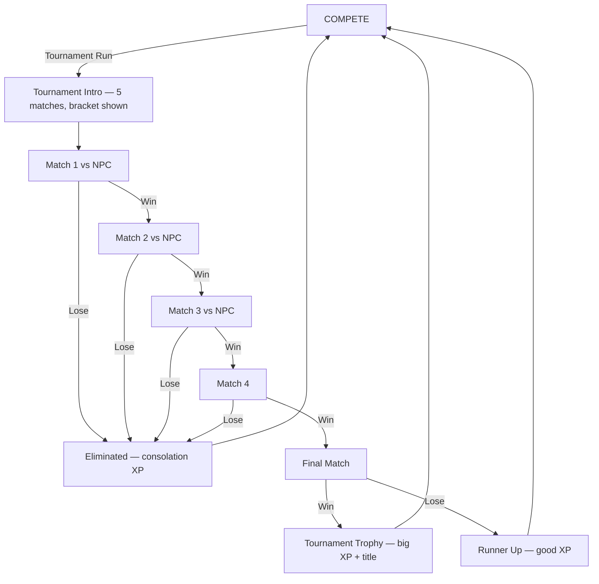
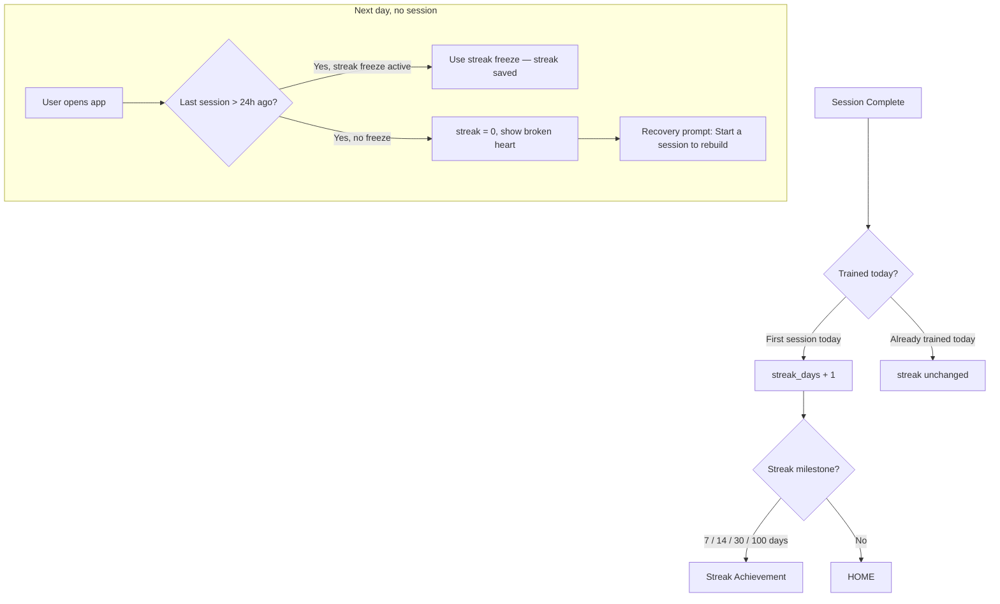
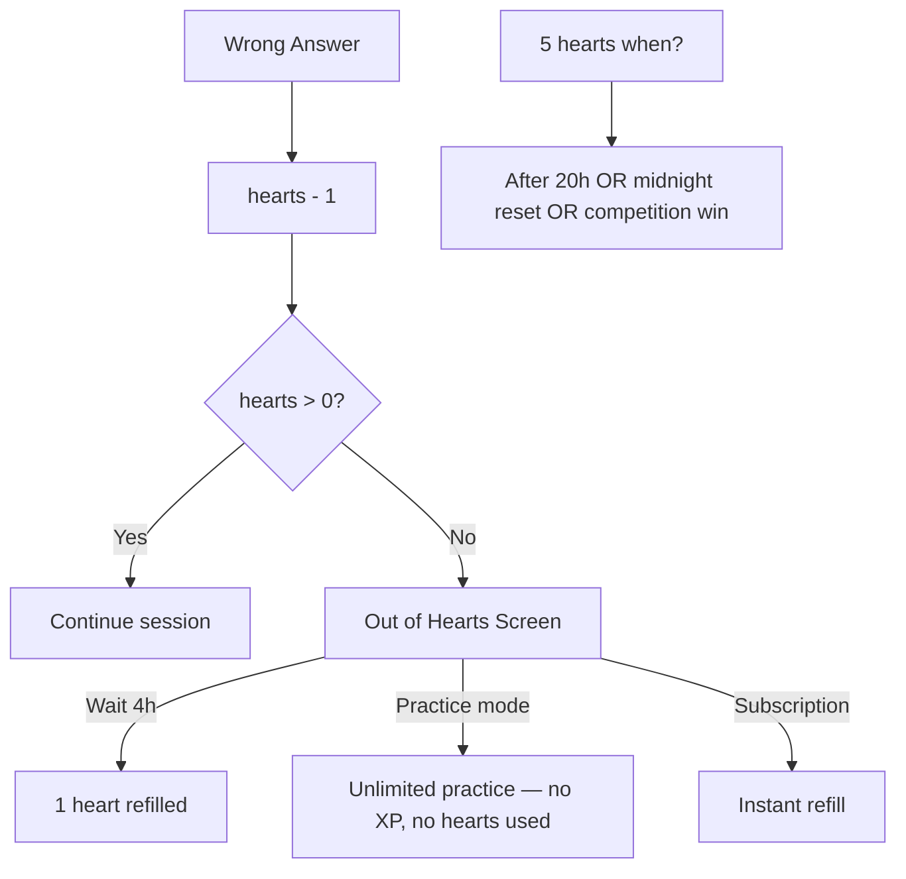
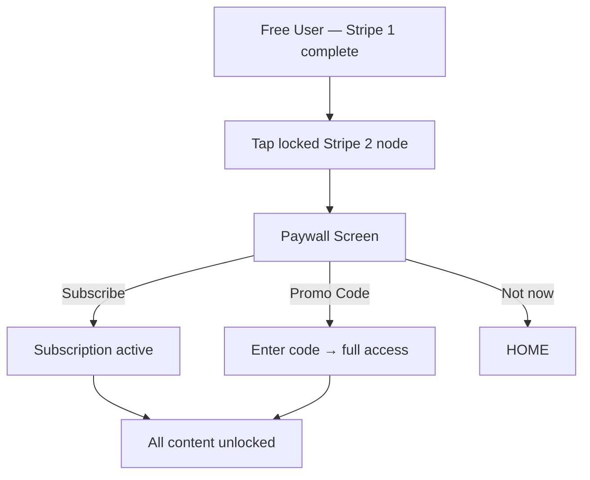

# BJJ Mind — User Flow
> Complete map of every possible user path through the app.

---

## First Launch Flow

---

## Return User — Daily Session

---

## Belt Test Flow

---

## Compete — vs Kat Match

---

## Compete — Tournament Run

---

## Streak Flow

---

## Hearts / Lives Flow

---

## Subscription / Paywall Flow

---

## Edge Cases

| Scenario | Behaviour |
|----------|-----------|
| User quits mid-session | Progress lost, no XP, hearts not spent |
| Timer runs out | Auto-submit = wrong answer |
| Belt test failed | Only failed tags re-unlocked for practice, no full retake |
| All hearts lost in belt test | Test ends, must wait / practice to retry |
| First day (no data) | Home shows Day 1 state, no streak counter |
| Streak freeze | Available to subscription users, max 2 per week |
| Offline | Cached questions available, sync on reconnect |
